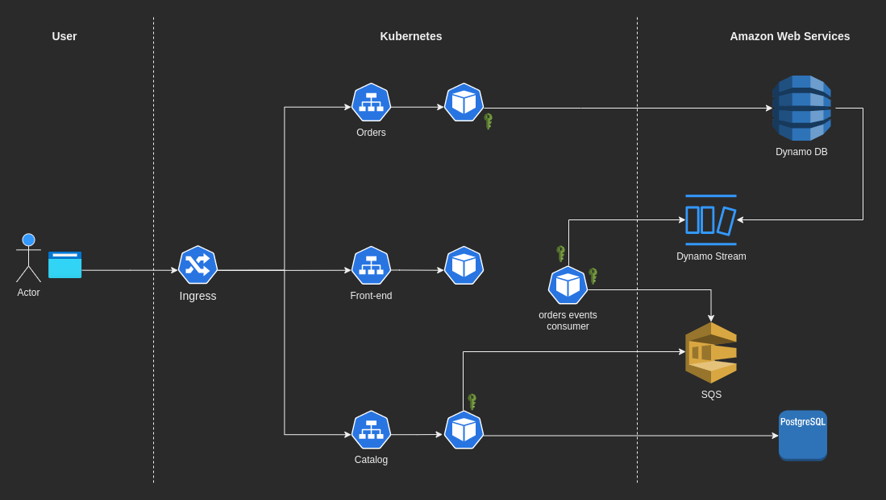

# SOA Demo App

Epic: [https://issues.redhat.com/browse/APPSVC-1240](https://issues.redhat.com/browse/APPSVC-1240)

At the time of writing the architecture is composed of the following 4 services:
- frontend: an NGINX server who provides the React application.
- catalog: a microservices in charge of handling the Catalog of products.
- orders: a microservice in charge of handling the Orders.
- orders-events-consumer: reacts to the events fired by the Orders' database and places messages in a Message Brokers.

The `catalog` microservice will also listen from messages published on a Message broker's Topic and updates the ordered Product's sold quantity.



## Run the demo-app

Clone this repo and it's submodules

```sh
git clone --recursive git@github.com:primaza/demo-app.git
```

### Run with Docker Compose

This mode will only use locally deployed services, so it won't integrate with AWS services but with locally deployed development versions of those services.
Use the following command:
```sh
docker compose up
```

### Run on Kubernetes

#### Configure AWS Secrets

Onto the kubernetes cluster will be installed the AWS operators that will need access to AWS.
The easiest way to provide this access, is relying on [long-term access keys](https://docs.aws.amazon.com/general/latest/gr/aws-sec-cred-types.html#access-keys-about).
That's not the most secure way to allow access, so feel free to use other options.

Once you have the Access Key pair (i.e., Access Key ID and Access Key Secret), use the companion tool to generate the needed secrets.
We assume you stored the secrets in a password manager, like pass.

```sh
AWS_ACCESS_KEY_ID=$(pass 'demo-soa/aws/access_key') AWS_SECRET_ACCESS_KEY=$(pass 'demo-soa/aws/secret_access_key') ./hack/aws-create-secrets.sh
```

#### Run on Minikube

You can use the script `./hack/run-on-minikube.sh` to easily run the application on a minikube cluster.

The script will accomplish the following actions:
- create a Minikube cluster using profile `demo-soa`
- build the image into Minikube (cfr. `minikube docker-env --help`)
- deploy the application on the cluster
- open the application site in a browser, or prompts the url in the console

##### Use local services

Local instances of the cloud services will be published on the minikube cluster and used instead of the cloud ones.

Use the following command to set install the demo app with local instances of AWS services:
```sh
LOCAL_SERVICES=true ./hack/run-on-minikube.sh
```

##### Use AWS services

Follow what described in section [Configure AWS Secrets](#configure-aws-secrets).

Then use the following command to setup minikube and install the demo-app:
```sh
./hack/run-on-minikube.sh
```

#### Run on OpenShift Local with CRC

##### Use local services

Local instances of the cloud services will be published on the minikube cluster and used instead of the cloud ones.

Use the following command to set install the demo app with local instances of AWS services:
```sh
LOCAL_SERVICES=true ./hack/run-on-crc.sh
```

##### Use AWS services

Follow what described in section [Configure AWS Secrets](#configure-aws-secrets).

Then use the following command to setup OpenShift local and install the demo-app:
```sh
./hack/run-on-crc.sh
```

## Generate Services' Clients with OpenAPI Generator

Refer to [https://openapi-generator.tech](https://openapi-generator.tech/#try).

```console
make generate-clients
```

